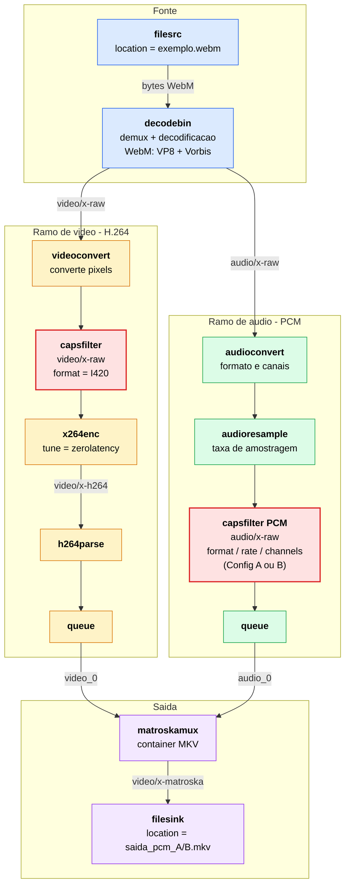
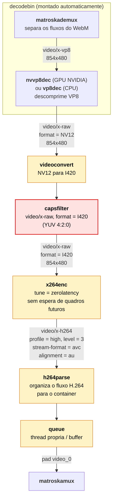
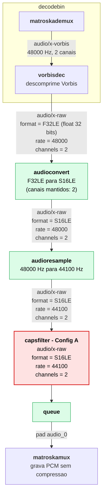
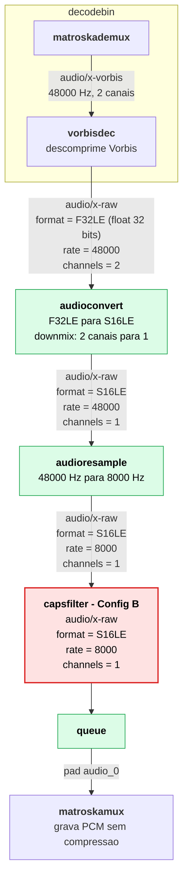
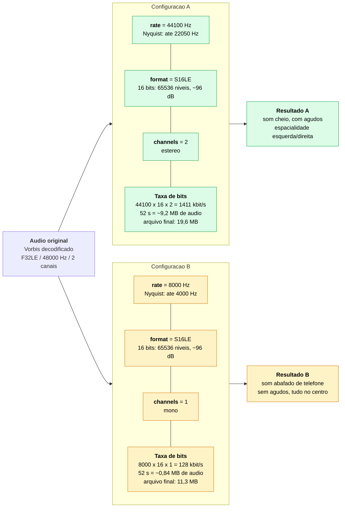
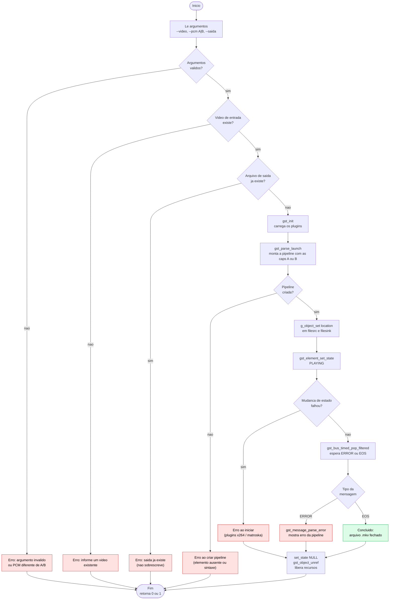
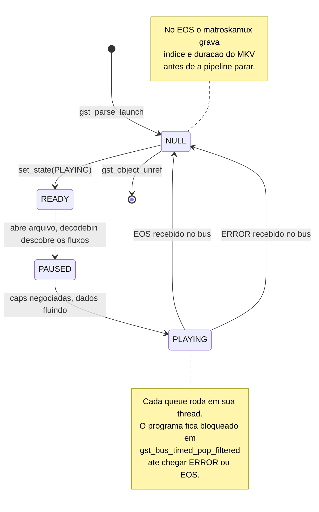
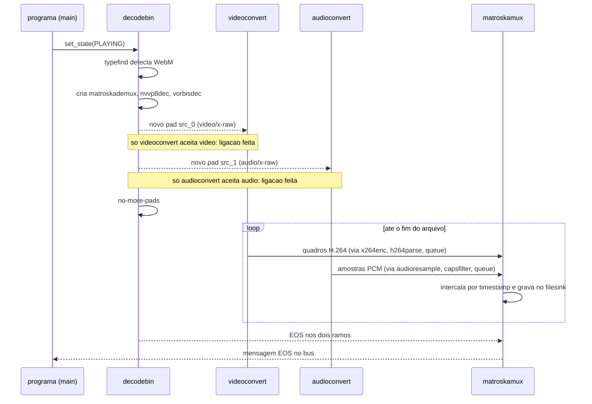

# Diagramas das pipelines - Exercicio 2

Diagramas em [Mermaid](https://mermaid.js.org/). O GitHub renderiza direto neste arquivo; para editar ou exportar PNG/SVG, cole cada bloco em <https://mermaid.live>.

Os caps mostrados nas ligacoes foram obtidos da execucao real com `gst-launch-1.0 -v` usando o trailer Sintel (`../exercicio-1/midia/exemplo.webm`).

1. [Visao geral da pipeline](#1-visao-geral-da-pipeline)
2. [Ramo de video (H.264)](#2-ramo-de-video-h264)
3. [Ramo de audio PCM - Configuracao A](#3-ramo-de-audio-pcm---configuracao-a)
4. [Ramo de audio PCM - Configuracao B](#4-ramo-de-audio-pcm---configuracao-b)
5. [Comparacao A x B](#5-comparacao-a-x-b)
6. [Fluxo do programa e tratamento de erros](#6-fluxo-do-programa-e-tratamento-de-erros)
7. [Estados da pipeline e mensagens do bus](#7-estados-da-pipeline-e-mensagens-do-bus)
8. [Ligacao dos pads dinamicos do decodebin](#8-ligacao-dos-pads-dinamicos-do-decodebin)

---

## 1. Visao geral da pipeline

Uma unica pipeline com dois ramos. O `decodebin` separa o arquivo em video e audio; cada ramo processa seu fluxo e o `matroskamux` junta os dois, sincronizados, no arquivo `.mkv`.



Texto equivalente usado no codigo (`src/principal.cpp`, `gst_parse_launch`):

```text
matroskamux name=mux ! filesink name=arquivo
filesrc name=entrada ! decodebin name=dec
dec. ! videoconvert ! video/x-raw,format=I420 ! x264enc tune=zerolatency ! h264parse ! queue ! mux.
dec. ! audioconvert ! audioresample ! <caps PCM A ou B> ! queue ! mux.
```

---

## 2. Ramo de video (H.264)

O video original (VP8) e descomprimido e depois comprimido de novo em H.264 (MPEG-4 Part 10 / AVC).



| Elemento | Funcao | Propriedade / caps |
|---|---|---|
| `videoconvert` | Converte a representacao dos pixels | NV12 para I420 |
| `capsfilter` | Obriga YUV 4:2:0 (perfil High, compativel com players) | `format=I420` |
| `x264enc` | Codifica em H.264 | `tune=zerolatency` |
| `h264parse` | Ajusta formato do fluxo para o muxer | `stream-format=avc`, `alignment=au` |
| `queue` | Separa o ramo em outra thread | - |

---

## 3. Ramo de audio PCM - Configuracao A

**A = S16LE / 44.100 Hz / 2 canais (estereo).** Qualidade de CD.



---

## 4. Ramo de audio PCM - Configuracao B

**B = S16LE / 8.000 Hz / 1 canal (mono).** Qualidade de telefone.



**Negociacao de caps:** quem decide o formato final e o `capsfilter`. Ele anuncia o que aceita; `audioresample` so muda a taxa, entao repassa para tras a exigencia de formato e canais, e `audioconvert` faz essa parte. Cada conversor faz apenas o que lhe cabe.

---

## 5. Comparacao A x B

O que muda em cada caracteristica PCM e o efeito no audio.



| Caracteristica | A | B | Muda? |
|---|---|---|---|
| Taxa de amostragem (`rate`) | 44.100 Hz | 8.000 Hz | Sim |
| Formato / profundidade (`format`) | S16LE | S16LE | Nao |
| Canais (`channels`) | 2 | 1 | Sim |
| Taxa de bits do audio | 1.411 kbit/s | 128 kbit/s | 11x menor |

O video e identico nas duas saidas; a diferenca de tamanho dos arquivos (19,6 - 11,3 = 8,3 MB) corresponde a diferenca de audio calculada (9,2 - 0,84 = 8,4 MB).

---

## 6. Fluxo do programa e tratamento de erros

Sequencia executada pela funcao `main` em `src/principal.cpp`.



---

## 7. Estados da pipeline e mensagens do bus



Um unico `set_state(PLAYING)` faz o GStreamer passar automaticamente por READY e PAUSED.

---

## 8. Ligacao dos pads dinamicos do decodebin

O `decodebin` so sabe quais fluxos existem depois de ler o arquivo, entao seus pads de saida aparecem durante a execucao. O `gst_parse_launch` deixa as ligacoes `dec. ! ...` pendentes e as completa quando cada pad surge.


