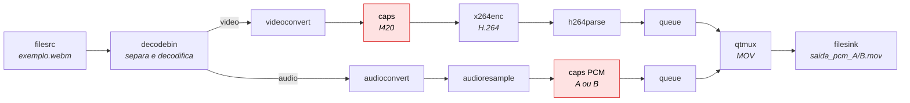
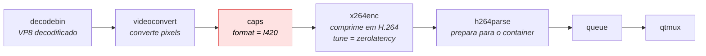
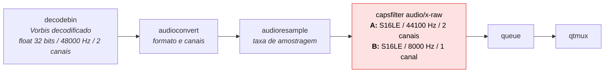
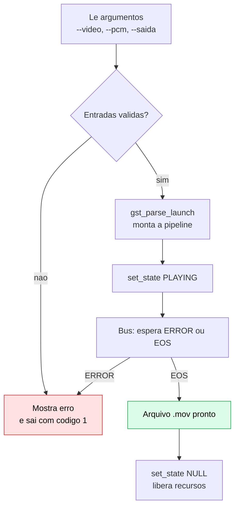

# Diagramas das pipelines - Exercicio 2

Diagramas em [Mermaid](https://mermaid.js.org/). O GitHub mostra os desenhos direto neste arquivo; para exportar PNG/SVG, cole cada bloco em <https://mermaid.live>.

## 1. Pipeline completa

Uma unica pipeline: o arquivo e separado em video e audio, cada ramo e processado e o `qtmux` junta os dois no `.mov`.

## 2. Ramo de video (H.264)

## 3. Ramo de audio (PCM)

O `capsfilter` define a configuracao; `audioconvert` e `audioresample` se ajustam a ele.

| | Config A | Config B | Propriedade do audio digital |
|---|---|---|---|
| Taxa (`rate`) | 44.100 Hz | 8.000 Hz | Nyquist: maior frequencia = taxa / 2. A vai ate 22 kHz (toda a audicao); B so ate 4 kHz, por isso soa abafado, como telefone |
| Profundidade (`format`) | 16 bits | 16 bits | 65.536 niveis, cerca de 96 dB de faixa dinamica nas duas |
| Canais (`channels`) | 2 (estereo) | 1 (mono) | B perde a separacao esquerda/direita |
| Taxa de bits | 1.411 kbit/s | 128 kbit/s | taxa x bits x canais: B gera 11x menos dados de audio |

## 4. Fluxo do programa e tratamento de erros

"Entradas validas" verifica: argumentos reconhecidos, PCM igual a A ou B, video de entrada existente e arquivo de saida ainda inexistente. Falhas ao criar a pipeline ou ao mudar para PLAYING tambem levam ao erro.
