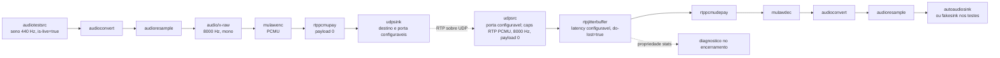

# Diagramas das pipelines

Os dois processos executam em paralelo. A seta UDP representa a rede, nao uma ligacao GStreamer entre processos.

```mermaid
flowchart LR
    A["audiotestsrc<br/>seno 440 Hz, is-live=true"] --> B[audioconvert]
    B --> C[audioresample]
    C --> D["audio/x-raw<br/>8000 Hz, mono"]
    D --> E["mulawenc<br/>PCMU"]
    E --> F["rtppcmupay<br/>payload 0"]
    F --> G["udpsink<br/>destino e porta configuraveis"]
    G -. "RTP sobre UDP" .-> H
    H["udpsrc<br/>porta configuravel; caps RTP PCMU, 8000 Hz, payload 0"] --> I["rtpjitterbuffer<br/>latency configuravel, do-lost=true"]
    I --> J[rtppcmudepay]
    J --> K[mulawdec]
    K --> L[audioconvert]
    L --> M[audioresample]
    M --> N["autoaudiosink<br/>ou fakesink nos testes"]
    I -. "propriedade stats" .-> O["diagnostico no encerramento"]
```
